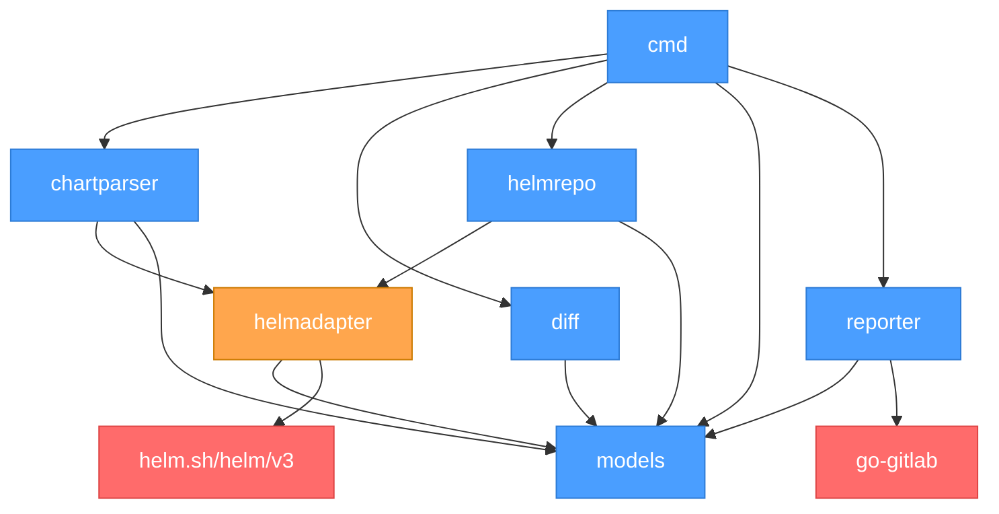

# Walkthrough — check-breaking-change

A CLI tool that detects breaking structural changes in Helm subchart dependency upgrades. Compares a current `Chart.yaml` against an override `Chart.yaml` with updated subchart versions.

---

## Table of Contents

1. [How It Works](#how-it-works)
2. [Project Structure](#project-structure)
3. [Package-by-Package Walkthrough](#package-by-package-walkthrough)
4. [Authentication](#authentication)
5. [Breaking Change Detection Rules](#breaking-change-detection-rules)
6. [CLI Usage](#cli-usage)
7. [Architecture Diagram](#architecture-diagram)
8. [Build and Push Docker Image (for amd64)](#build-and-push-docker-image-for-amd64)

---

## How It Works

When subchart dependency versions change (e.g., via Renovate, manual update, or CI pipeline), this tool:

1. Reads the **current** `Chart.yaml` from a chart directory (base version)
2. Reads an **override** `Chart.yaml` with updated subchart versions (proposed version)
3. Identifies which subchart versions changed
4. For each changed subchart, fetches the **old** and **new** upstream `values.yaml` from the Helm repository (HTTP or OCI)
5. Compares the upstream values against the parent chart's `values.yaml` overrides
6. **Checks transitive/nested dependencies** — if a subchart itself has dependencies that the parent overrides, those are checked too
7. If a structural breaking change is detected → creates a **GitLab issue** and fails the pipeline
8. If no breaking changes → exits cleanly

---

## Project Structure

```
.
├── main.go                          # Entry point → cmd.Execute()
├── go.mod                           # Dependencies (Helm SDK v3, Cobra, go-gitlab)
├── cmd/
│   └── root.go                      # CLI flags, orchestration logic
├── internal/
│   ├── models/
│   │   └── types.go                 # Domain types (Dependency, DiffResult, Report, RepoAuth)
│   ├── chartparser/
│   │   ├── parser.go                # Chart.yaml/values.yaml parsing, version change detection
│   │   └── parser_test.go           # 14 tests
│   ├── helmadapter/
│   │   ├── chart.go                 # Helm SDK chart.Metadata parsing + conversion
│   │   ├── repo.go                  # Helm SDK getter/repo/loader for HTTP repos
│   │   └── oci.go                   # Helm SDK registry client for OCI repos
│   ├── helmrepo/
│   │   ├── fetcher.go               # Fetcher interface (FetchValues + FetchChartDeps)
│   │   ├── http_fetcher.go          # HTTPFetcher implementation
│   │   ├── oci_fetcher.go           # OCIFetcher implementation
│   │   └── factory.go               # NewFetcher() — routes oci:// vs https://
│   ├── diff/
│   │   ├── engine.go                # Recursive map comparison engine
│   │   ├── engine_test.go           # 17 tests
│   │   ├── typecheck.go             # Safe type conversion detection
│   │   └── typecheck_test.go        # 9 tests
│   └── reporter/
│       ├── reporter.go              # Reporter interface
│       ├── markdown.go              # Markdown + stdout formatting
│       └── gitlab.go                # GitLab issue creation
```

---

## Package-by-Package Walkthrough

### `main` — Entry Point

`main.go` calls `cmd.Execute()`. That's it.

### `cmd` — CLI & Orchestration

`cmd/root.go` is the orchestrator. It takes two positional arguments: `[chart-dir] [override-chart-yaml]` and wires everything together:

| Step | What happens | Package used |
|------|-------------|--------------|
| 1 | Read `Chart.yaml` from chart directory | `os.ReadFile` |
| 2 | Read override `Chart.yaml` from given path | `os.ReadFile` |
| 3 | Parse both `Chart.yaml` files | `chartparser` → `helmadapter` |
| 4 | Find which subchart versions changed | `chartparser` |
| 5 | Read parent `values.yaml` from chart directory | `os.ReadFile` + `chartparser` |
| 6 | Build auth credentials from CLI flags / env vars | `models` |
| 7 | For each changed subchart: create fetcher, fetch old+new upstream values, compare | `helmrepo` → `helmadapter` → `diff` |
| 7b | Check transitive/nested subchart dependencies | `helmrepo.FetchChartDeps` → `chartparser` → `diff` |
| 8 | Output results (stdout, markdown, or GitLab issue) | `reporter` |

**Key details:**
- The fetcher is created **per subchart** via `helmrepo.NewFetcher()`, so a single chart can have dependencies from both HTTP and OCI registries.
- Transitive deps are checked with **cycle detection** via a visited map.
- Only transitive deps that the parent `values.yaml` overrides are checked.

### `models` — Domain Types

All shared data structures live here. No business logic except `ResolveKey()` (returns alias if set, else name) and `HasCredentials()`.

Key types:
- **`Dependency`** — name, alias, version, repository, condition, tags
- **`VersionChange`** — old version → new version for a dependency
- **`DiffResult`** — one detected difference (key path, change type, breaking flag)
- **`Report`** — aggregates all subchart reports
- **`RepoAuth`** — credentials for HTTP and OCI repos (username, password, token, Docker config path, CA file)

### `chartparser` — Chart.yaml & values.yaml Parsing

- **`ParseChartFile()`** — delegates to `helmadapter.ParseChartMeta()` which uses the Helm SDK's `chart.Metadata` type
- **`ParseValues()`** — standard `yaml.Unmarshal` into `map[string]interface{}`
- **`FindVersionChanges()`** — builds a map of old deps by key, iterates new deps, returns only those with version differences
- **`IsActive()`** — evaluates `condition` and `tags` against parent values
- **`ExtractSubchartValues()`** — extracts `values[key]` subtree (using alias or name as key)

### `helmadapter` — Helm SDK Isolation Layer

**Only package that imports `helm.sh/helm/v3`.**

**chart.go:**
- `ParseChartMeta()` — unmarshals into `chart.Metadata` using `sigs.k8s.io/yaml`
- `ConvertDependencies()` / `FromHelmDependency()` — converts SDK types to internal models

**repo.go:**
- `FetchChartValues()` — returns chart's `values.yaml`
- `FetchChartDependencies()` — returns chart's `Chart.yaml` dependencies (for transitive checking)
- Both use `fetchAndLoadChart()` — shared flow: resolve URL → download → load archive
- Token auth: `getter.WithBasicAuth("", token)` with `getter.WithPassCredentialsAll(true)`

**oci.go:**
- `FetchOCIChartValues()` — pull + extract values
- `FetchOCIChartDependencies()` — pull + extract dependencies
- Both use `fetchAndLoadOCIChart()` — shared flow: pull → load archive
- `LoginOCI()` — explicit login with username/password

### `helmrepo` — Fetcher Abstraction

**fetcher.go** defines the interface:
```go
type Fetcher interface {
    FetchValues(repoURL, chartName, version string, auth *models.RepoAuth) (map[string]interface{}, error)
    FetchChartDeps(repoURL, chartName, version string, auth *models.RepoAuth) ([]models.Dependency, error)
}
```

**factory.go** — `NewFetcher(repoURL, auth)`: `oci://` → `OCIFetcher`, else → `HTTPFetcher`

### `diff` — Breaking Change Detection Engine

**engine.go** — `Compare()` recursively walks only keys in `parentOverrides`:
```
For each key in parentOverrides:
  ├─ Key removed in new upstream? → BREAKING
  ├─ Key added in new upstream?   → informational
  ├─ Scalar ↔ Map transition?     → BREAKING (structural)
  ├─ Both maps?                   → recurse deeper
  └─ Both scalars?                → value-only or safe conversion (NOT breaking)
```

**typecheck.go** — `IsSafeConversion()` checks lossless conversions:
- `string "3"` ↔ `int 3`, `string "3.14"` ↔ `float64 3.14`
- `string "true"` ↔ `bool true`, `int 5` ↔ `float64 5.0`

### `reporter` — Output Formatting

- **`FormatStdout()`** — one-liner per subchart: ✅ or ⛔ with details
- **`FormatMarkdown()`** — full report with tables, collapsible diffs, informational section
- **`GitLabReporter`** — creates a GitLab issue via `go-gitlab` with labels `["breaking-change", "helm"]`

---

## Authentication

A single `RepoAuth` struct handles HTTP and OCI scenarios:

| Source | CLI Flag | Env Variable | Used For |
|--------|----------|-------------|----------|
| Username | `--helm-repo-user` | `HELM_REPO_USERNAME` | HTTP basic auth + OCI login |
| Password | `--helm-repo-pass` | `HELM_REPO_PASSWORD` | HTTP basic auth + OCI login |
| Token | `--helm-repo-token` | `HELM_REPO_TOKEN` | HTTP token auth (GitLab/Artifactory) |
| Docker Config | `--oci-registry-config` | `OCI_REGISTRY_CONFIG` | OCI registry auth (fallback) |
| CA Certificate | `--oci-registry-ca` | `OCI_REGISTRY_CA_FILE` | TLS for private registries |

**HTTP auth precedence:**
1. Username + Password → `getter.WithBasicAuth(user, pass)`
2. Token only → `getter.WithBasicAuth("", token)` (standard pattern for GitLab Package Registry)
3. No auth (public repos)

**OCI auth precedence:**
1. Username + Password → `registry.LoginOptBasicAuth()`
2. Docker config.json → `registry.ClientOptCredentialsFile()`
3. No auth (public registries)

---

## Breaking Change Detection Rules

| Scenario | Breaking? | Example |
|----------|-----------|---------| 
| Structural change (scalar → map) | **YES** | `image: "nginx:v1"` → `image: {registry: "nginx", tag: "v1"}` |
| Structural change (map → scalar) | **YES** | `image: {registry: ..., tag: ...}` → `image: "nginx:v1"` |
| Key removed upstream (parent overrides it) | **YES** | Upstream removes `replica`, parent sets `replica: 3` |
| New key added upstream | No | Upstream adds `newField: value` |
| Value-only change (same key, same type) | No | `replica: 3` → `replica: 5` |
| Safe type conversion | No | `port: "8080"` → `port: 8080` |

**Important:** Only keys that the parent `values.yaml` overrides are checked. If the parent doesn't override a key, upstream changes to that key are ignored.

**Transitive dependencies:** If a subchart has its own dependencies and the parent `values.yaml` contains overrides nested under them (e.g., `gateway-helm.sub-db.replica`), those transitive dependencies are also checked for breaking changes.

---

## CLI Usage

```bash
# Basic dry-run (prints report to stdout)
check-breaking-change . chart-override.yaml --dry-run

# Full CI mode (creates GitLab issue on breaking changes)
check-breaking-change . chart-override.yaml \
  --gitlab-url "$CI_SERVER_URL" \
  --gitlab-token "$GITLAB_TOKEN" \
  --project-id "$CI_PROJECT_ID" \
  --mr-id "$CI_MERGE_REQUEST_IID"

# With authenticated HTTP Helm repo (username + password)
check-breaking-change . chart-override.yaml \
  --helm-repo-user "$HELM_USER" \
  --helm-repo-pass "$HELM_PASS" \
  --dry-run

# With token-based HTTP Helm repo (GitLab Package Registry)
check-breaking-change . chart-override.yaml \
  --helm-repo-token "$HELM_REPO_TOKEN" \
  --dry-run

# With OCI registry (using Docker config for auth)
check-breaking-change . chart-override.yaml \
  --oci-registry-config ~/.docker/config.json \
  --dry-run

# With OCI registry (explicit credentials)
check-breaking-change . chart-override.yaml \
  --helm-repo-user "$REGISTRY_USER" \
  --helm-repo-pass "$REGISTRY_PASS" \
  --dry-run
```

**Exit codes:**
- `0` — No breaking changes
- `1` — Breaking changes detected (or error)

---

## Architecture Diagram

```
┌─────────────────────────────────────────────────────────┐
│                    cmd/root.go                          │
│          (CLI flags + local file orchestration)          │
│                                                         │
│  chart-dir/Chart.yaml ──┐    ┌── override-Chart.yaml    │
│  chart-dir/values.yaml ─┘    └──────────────────────    │
└──────┬──────┬──────┬──────┬──────────────────────────────┘
       │      │      │      │
       ▼      │      │      ▼
 ┌────────────┐│      │┌──────────┐
 │chartparser ││      ││ reporter │
 │            ││      ││          │
 │ parse +    ││      ││ markdown │
 │ resolve    ││      ││ + gitlab │
 └──────┬─────┘│      │└──────────┘
        │      │      │
        ▼      ▼      │
 ┌─────────────────┐  │
 │   helmadapter   │◄─┘       ┌─────────────────┐
 │  (SDK boundary) │          │    helmrepo      │
 ├─────────────────┤          │                  │
 │ chart.go        │◄─────────│ Fetcher iface    │
 │ repo.go         │          │ HTTPFetcher      │
 │ oci.go          │          │ OCIFetcher       │
 └─────────────────┘          │ Factory          │
        │                     └─────────────────┘
        ▼
  ┌───────────────────┐      ┌──────────┐
  │  helm.sh/helm/v3  │      │   diff   │
  │  (SDK - isolated) │      │          │
  │                   │      │ compare  │
  │  chart.Metadata   │      │ engine   │
  │  getter / repo    │      └──────────┘
  │  loader           │
  │  registry         │
  └───────────────────┘
```

**Key isolation:** Only `helmadapter/` imports the Helm SDK.

---

## Tests

```bash
# Run all tests
go test ./...

# Run with verbose output
go test ./... -v

# Run specific package
go test ./internal/chartparser/... -v   # 14 tests
go test ./internal/diff/... -v          # 26 tests
```

All tests pass. Coverage spans chart parsing, alias resolution, version change detection, condition/tag evaluation, structural diff detection, safe type conversion, and parent type mismatch detection.

---

## Package Dependency Graph



---

## Build and Push Docker Image (for amd64)

To build and push the Docker image for amd64 to Docker Hub (`linuxarpan/helm-breaking-chnage`):

```sh
# 1. Ensure QEMU is enabled for cross-arch builds (one-time setup)
docker run --privileged --rm tonistiigi/binfmt --install all

# 2. Create and use a buildx builder (if not already)
docker buildx create --name mybuilder --use || docker buildx use mybuilder
docker buildx inspect --bootstrap

# 3. Build and push for amd64

docker buildx build --platform linux/amd64 \
  -t linuxarpan/helm-breaking-chnage:latest \
  -t linuxarpan/helm-breaking-chnage:v1.0.0 \
  --push .
```

- This will build the image for `linux/amd64` and push both `latest` and `v1.0.0` tags to Docker Hub.
- You must be logged in to Docker Hub (`docker login`) as `linuxarpan`.

---

